# ACID

ACID is short for **A**lgorithms **C**reate **I**mage **D**ata and is a simple, general purpose video synthesizer for creating live visuals and computer generated images and animations. It works somewhat similar to an analog synthesizer with a little bit of Photoshop thrown in.

ACID features a clean graphic user interface, that can be opened in a seperate window to interact with the synthesizer on another screen. ACID has built in export to PNG and JPG and can record GIFs and WEBM videos of any length straight out of the program.

This is how the interface looks:


*GUI is undocked*


*GUI is opened in the main window*

These are some patches, that I made on ACID (they are available in the `/presets` directory):

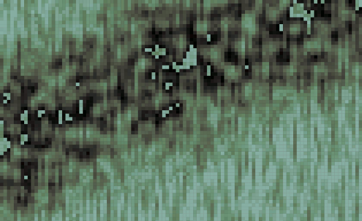

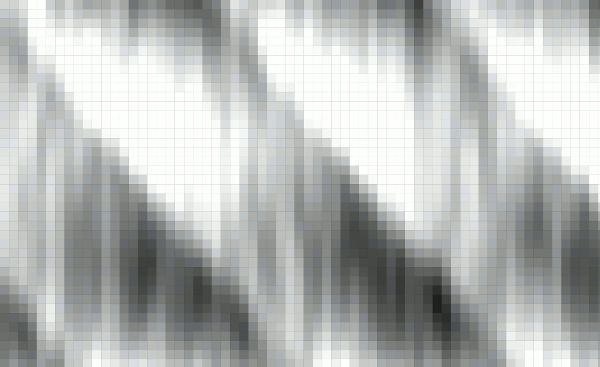

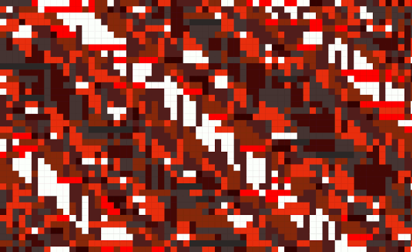

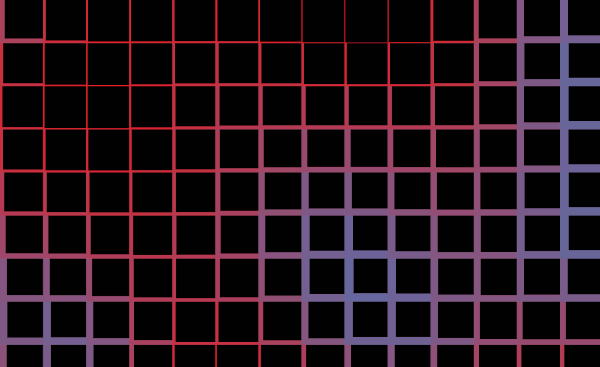

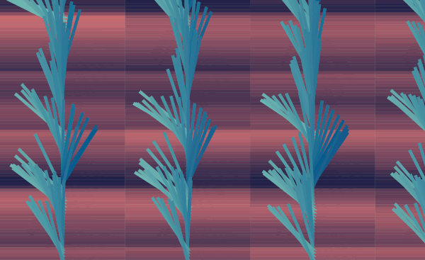

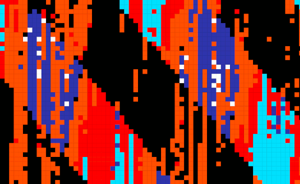

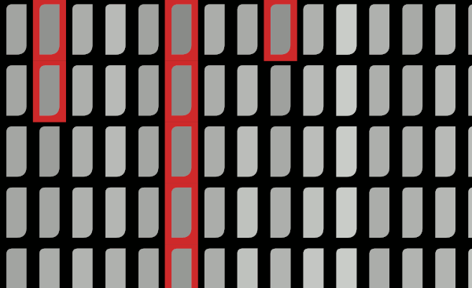

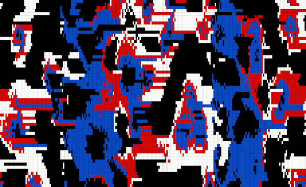

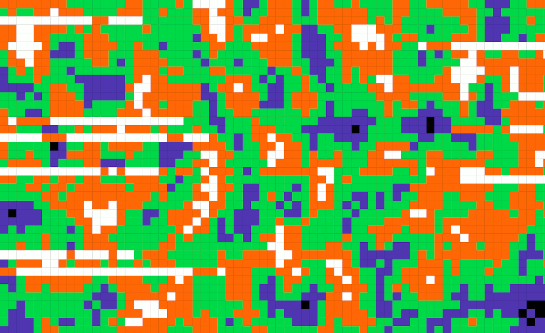

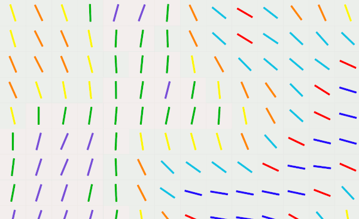


## Installation

You can either install a build for your platform or run ACID yourself with `npm`.

I tested the builds on:

- Mac OS/mac: macOS Catilina, 10.15.6, 16GB RAM, 2.8 GHz Quad-Core Intel Core i7, Intel HD Graphics 630 1536 MB
- Linux/deb: Linux Mint Cinnamon, 4.0.10 (4.15.0-20-generic Kernel), 4GB RAM, 1.1GHz * 7, Intel Pentium Silver N5000, Intel Corporation Device 3184 
- Window/win32: Windows 10 Home, 1803, 4GB RAM, 1.1GHz * 7, Intel Pentium Silver N5000, Intel Corporation Device 3184 

To download a build for your platform head over to [acidatm.itch.io/acid](https://acidatm.itch.io/acid) and download a build there. The download is free, there is only an optional donation.


Presets can be found in the `/presets` directory or can be downloaded on *itch.io* as well.


To run ACID withen *electron.js*, install `npm` and `git` (if you don't have them installed), then open your terminal and run:

```bash
git clone https://github.com/acidatm/acid
cd acid/app/
npm install
npm start
```


## Performance

ACID runs in realtime in a *Chromium* environment and uses *JavaScript* and *canvas*. This might not be the most efficient way to do realtime graphics. But thats what I know, so thats what it is written in. But it works. I test every build on the absolute most crushing settings, and if it runs and does so above 1 fps, it's fine. The current build was proven to work on  `macOS Catilina, 10.15.6, 16GB RAM, 2.8 GHz Quad-Core Intel Core i7, Intel HD Graphics 630 1536 MB`.

With the following settings:

- 3360 × 2100 Screen Resolution
- 5 oscilators, running as "osc" with random settings and 4 effects
- 4 effects on the bus
- Complex 2d render mode with random settings and gradient color mode
- 30 fps
- Resolution 1, Resolution X 6, Resolution Y 6

I then tried exporting a GIF. And it worked.

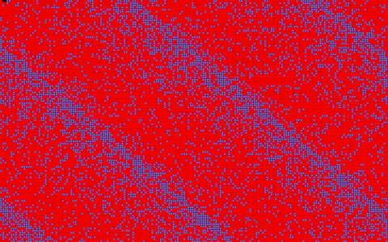

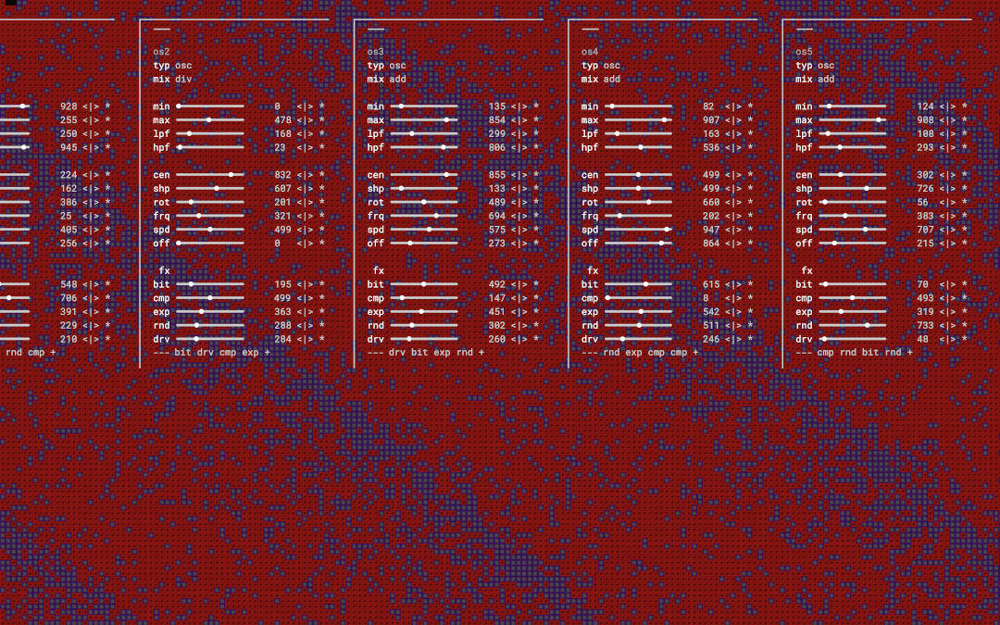

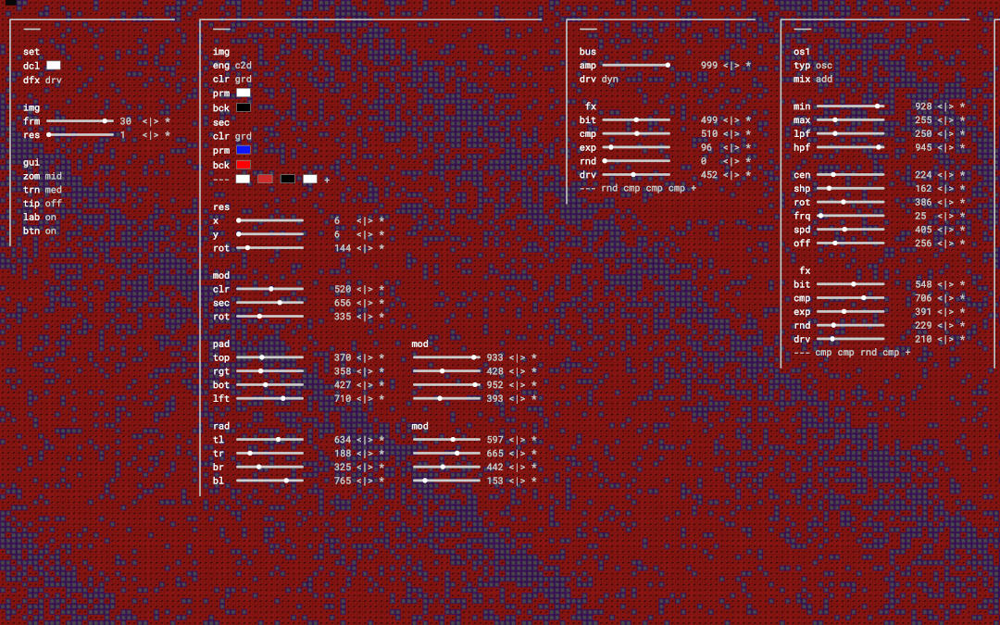

If the program crashes or is very slow: please excuse me, I'm working on it! To make things a little better you can try these things (in order of influence):

- Set lower framerate, something lower then 10
- Set lower resolution, around 20 or higher should be fine
- Only use the simple 2D (s2d ) render engine
- Avoid using effects
- Stick to indexed or rgb color mode
- Do not use "div" as a mixing mode

And if you somehow gotten the patch memory into an unusable state, you can click on *Menubar > File > Reset Patch* to empty the patch memory and load up the default patch.

## Updates

I originally planned to deploy a dedicated update server, so that the application could update itself. However I am not a backend person (if you are, please hit me up!) and also not willing to go through the code signing process for the various platforms, that would be needed to use *update.electronjs.org*. So you will need to manually install updates by simply uninstalling the old version of the software and downloading the new one over at: [acidatm.itch.io/acid](https://acidatm.itch.io/acid).

All minor updates, like bug fixing and optimisation, will not be released with a dedicated build. All new features or extensions will first be commited into the GitHub repository and will then, when there is a good amount of new stuff, be released as a larger update with a dedicated build on *itch.io*. If you want to stay on the edge, consider cloning this repo or watching it. If you only want to be notified upon release of new builds of major versions either follow me on [itch.io](https://acidatm.itch.io/) or send me an [email](mailto:johannes.hassenstein@protonmail.com), I'll add you to my email list and you'll recieve a short notice, when a new version is released.

New major releases (as well as new commits to the repo, if your running ACID yourself) may break old patches. In this case you may either look into the release notes and change the patches manually (it's just JSON!) or you may need to run *Menubar > File > Reset Patch* to empty the patch memory and load the up to date default patch.

## Usage

If you make something cool with this software, please be so kind to send me an email to [johannes.hassenstein@protonmail.com](mailto:johannes.hassenstein@protonmail.com), I'll be super happy to hear about it! If you post something on *Instagram*, feel free to use *#madeonACID* and tag me [@acidatm](https://instagram.com/acidatm).

## Issues

Please add any issues, bugs or errors as an issue to this repository. If you have any ideas or feature requests add them there as well. If you build something on the base of this software: cool! Please fork it or commit to a new branch and open a merge request. I'll be happy to add your additions together with the next major release.

If you do not have a Github account you can also send me an email to [johannes.hassenstein@protonmail.com](mailto:johannes.hassenstein@protonmail.com) or comment on the [itch.io](https://acidatm.itch.io/acid) page.

## Acknowledgement

I was enspired by the works of these people:

- The ORCA sequencer by Rekka & Devine: https://hundredrabbits.itch.io/
- The works of Viznut, especially IBNIT: http://countercomplex.blogspot.com/2011/12/ibniz-hardcore-audiovisual-virtual.html
- And various stuff found on esoteric.codes: https://esoteric.codes/

## Technology

ACID is written in *JavaScript* and uses the *canvas* API to create its images. The user interfaces are right now standard *HTML* and *CSS*, but I plan to switch over to *React.js* somewhere in the near future. The app is packaged with *electron.js* and uses some functions of *node.js*. The main process and user interfaces communicate over *ipc*. Patches are stored as *JSON* data in plain text files.

## Structure

ACID has 3 parts:

- ACID:CORE - this is where the render process requests values and the state of the current patch is transformed into usable values
- ACID:RENDER - the render process requests values from the core and can do with them what it wishes - mostly creating some form of visual representation of the current state of system. The render process has multiple render engines available, each is specialised in a certain type of visual.
- ACID:GUI - the user interface for creating patches. The GUI uses table layouts with input fields, buttons, extendable lists and radio buttons. 

The core will automatically create a render process and the main window will have a version of the GUI always available. You may create an additional, GUI only window from *Menubar > Window > Unlatch GUI*. You could then use a two screen setup or a beamer to show the generated images fullscreen while controlling them with the GUI in the other window.

All render engines can request 3 dimensional parameters from the core. Mostly x,y and time, where time is being tracked by the render process itself. These values are passed to the core and the core returns a floating point value between 0 and 1. What happens with this value is completely up to the render process. For example the value could be mapped to a grayscale, where 0 is black and 1 is white.

Values are generated by mixing oscilators and applying effects to them as well as to the sum of all oscillators.

## Documentation

All values in the GUI range between 0 and 999, where 0 is the minimum value and 999 is the maximum. The GUI can be toggled either with the space bar or using the options in *Menubar > Window*. The GUI can also be opened in a second window.

The labels next to the sliders can be used to set a slider to specific value. The buttons next to the labels can be used to minimize, center, maximize or randomize the slider value. Both can be disabled from the *set* part of the GUI.

### Oscilators

An oscilator is either a cyclic transfer function or a noise based algorithm. A cyclic transfer function takes a value between 0 and infinity and returns a value between 0 and 1, the exact distribution of the values inbetween is determined by the oscilators waveform. The amount of values after which the oscilator repeats is determined by its frequency.

You can use oscilators as fixed filters by setting the *spd* parameter to 0. This will stop the oscilator from moving entirely. You can then control the exact character of the filter with the *frq*, *off* and *rot* parameters.

If you need a constant fixed value from an oscilator, you can use a *sqr* oscilator, with a *spd* of 0 and a low *frq*. You can then control the exact value using the *min* or *max* parameter.

If you need a completely random texture, create an oscilator with a medium value and apply a high *rnd* effect on it.

All oscilators have an additional "run" property, which can be set to quickly mute an oscilator. You can toggle it by clicking on "osx" (where x is the oscilator number) in the GUI. The run property behaves identical to the *off* type, but doesnt change the type of the oscilator.

#### Cyclical oscilators

These are the available cyclical oscilators:

- **sqr** (Square) - will create a squarewave, that is either high or low, but has no inbetween states
- **saw** (Sawtooth) - will create a sawtooth wave, that starts high and falls to low in a linear fashion
- **tri** (Triangle) - will create a triangle wave, that switches between high and low in linear fashion
- **sin** (Sine) - will create a sine wave, that switches between high and low in non linear fashion
- **osc** (Oscilator) - will create a flexible oscilator, which can take any shape between a pure triangle over a pure sine to pure square. The pulse width can be modified, which can turn a triangle into a ramp or saw, or change the width of a squarewave. But it can also do any shape inbetween.


For each oscilator these are the important parameters:

- **typ** (Type) - will determine the type of oscilator to use
- **min** (Minimum) - sets the minimum amplitude (normally 0)
- **max** (Maximum) - sets the maximum amplitude (normally 999)
- **lpf** (Low Pass Filter) - Values above this threshold will be cut. The filter behaves relative to *min* and *max*
- **hpf** (High Pass Filter) - Values below this treshold will be cut. The filter behaves relative to *min* and *max*
- **mix** (Mixing) - The way this oscilator should be mixed with other oscilators
  - *ADD* (Additive) - Add the value to the mix
  - *SUB* (Subtractive) - Removes the value from the mix
  - *MLT* (Multiply) - Multiplies the mix with the value
  - *DIV* (Divide) - Divides the mix by the value
  - *MOD* (Modify) - Modify the mix by the value. This mixing mode is somewhat esoteric. It is based on "%" which in programming means rest of division.
- **rot** (Oscilator Rotation) - Will rotate the oscilator in 2D space
- **frq** (Oscilator Frequency) - Determines the frequency of the oscilation
- **spd** (Oscilator Speed) - Determines how fast the oscilator moves through 2D space in the direction set by *rot*
- **off** (Oscilator Offset) - Will change the phase of the oscilation, which us really only useful when *speed* is at 0

The *osc* oscilator has these additional parameters:

- **cen** (Oscilator Center) - sets the high point of the oscilation relative to the wavelength. 0 means right at the start (which would make a triangle wave a saw wave), 999 means right at the end (which would make a triangle wave a ramp wave)
- **shp** (Oscilator Shape) - determines the general shape of the oscilator. It does so by fading between pure triangle wave (0), pure sine wave (499) and pure squarewave (999)

#### Noncyclical oscilators

These are the available, noncyclical oscilators:

- **plx** (Simplex Noise) - An advanced correlating noise algorithm
- **prl** (Perlin Noise) - A less advanced correlating noise algorithm
- **off** (Off) - turns the oscilator off

The noncyclical oscilators use some of the  cyclical oscilator settings, however they are used somewhat different:

- **frq** (Oscilator Frequency) - Determines the frequency of the noise plane, which will feel more like its resolution or graininess maybe
- **off** (Oscilator Offset) - Will move to a fixed value on the plane of the noise

 There are also a couple of additional settings for the two noise algorithms, as they are 3 dimensional. The oscilator settings control the z axis, the other two axis are controlled by their respective parameters. All axis have the same set of parameters.

The noise algorithms are seedable, which means same values in, same values out. You can reseed the noise algorithms from *Menubar > Render > Reseed*.

### Effects

All oscilators as well as the master bus can have any number of effects applied to them. Which effects are applied is set by the effects chain ("--- + " in the GUI). Clicking on "+" will add a new effect to the chain, clicking on an effect will flip through the different effect types, clicking on "---" (which will then show "clr") will clear the effect chain. Effects are passed through from left to right.

- **---** (List) - marks the presence of a list. Clicking will clear the list
- **+** (Add) - can be clicked to add new entrys to the list.

The settings for all effects in the chain are the same. However you can use the chain to apply effects in different order or multiple times. The settings are set in the *fx* part of the respective GUI section:

- **bit** (Bitreduction) - Will reduce the number of possible values down to only a single one. 0 means no reduction, 999 means maximum reduction.
- **cmp** (Compression) - Will make lower values higher while influencing higher values less.
- **exp** (Expansion) - Will make lower values even lower while influencing higher values less. Works somewhat in reverse to compression.
- **rnd** (Randomization) - Will randomly change values. A low setting will result in a more "analog" look, while a high setting will make things very glitchy
- **drv** (Drive) - Will amplify all values equally. Can be used as a preamp or overdrive.

### Masterbus

The parameters for the masterbus can be found under "bus". The masterbus sums all oscilators together, passes them through an effect chain and then makes the sum available to the render process.

- **amp** (Masteramplification) - can be used to amplify the summed signal
- **drv** (Drivetype) - this is the clipping stage of the master amplifier, there are 3 settings available:
  - **clp** (Clip) - Will simply clip all values over 1 and make them 1
  - **mod** (Modify) - Will wrap all values over 1 until they are below 1. 1.5 would become 0.5, 2.3 would become 0.3 and so on.
  - **dyn** (Dynamic) - Will redistribute all values on a range between the frames lowest and highest value, making it impossible to clip the amp (however you can use a compressor or drive and a low pass filter to achieve the effect on an oscilator level)

The masterbus has the same effect chain as all oscilators have. 

### Render

The parameters for the render process can be found under "img". The render process determines how the values generated by ACID and the configuration set in the GUI are used to generate images. Not all settings are available at all times, some may only be visible when a certain color mode or render engine is active.

- **eng** (Render Engine) - Changes the used render engine and also which parameters are displayed in the GUI
  - *s2d* (Simple 2D) - A simple two dimensional, pixelbased renderengine, where you can only change general pixel size and effect the pixel color with ACID
  - *c2d* (Complex 2D) - A more complex two dimensional, cell based renderengine, where you can change general cell size and effect padding, inner corner radius, rotation and color of each cell with ACID
- **clr** (Colormode) - Changes the colormode. You can click on the GUI label to activate a fixed HSL based color mode, which can be helpfull to see how the oscilators effect each other.
  - *rgb* (Linear RGB) - ACID can effect a linear RGB space. The range is determined by the value of *prm*
  - *grd* (Gradient) - ACID can effect the value on a range between two colors. The two colors are determined by *bck* and *prm*
  - *ndx* (Indexed) - ACID can effect the exact value from a fixed set of values. The values are determined by a list that appears in the *img* tab when indexed color mode is active
  - *hsl* - ACID can effect a linear HSL space. The range is determined by the value of *prm*
- **prm** (Primary Color) - Sets the primary or foreground color for the render engine. Is used as the gradient end in *lin*, the RGB base color in *rgb* and the HSL settings in *hsl* (R is hue, G is saturation, B is lightness)
- **bck** (Background Color) - Sets the secondary or background color for the render engine. Is used as the gradient start in *lin*
- **x** (X Scale) - The scale on the X axis of a pixel or the relative width of a pixel, whatever, you'll understand it
- **y** (Y Scale) - The scale on the Y axis of a pixel or the relative height of a pixel, whatever, you'll understand it as well
- **mod** (Modifiers) - How much ACID can effect the corresponding parameter

These additional parameters are only available in the *c2d* render engine:

- **sec** (Secondary Color) - Parameters in this section influence the background of the cells. The settings mirror those of the general color settings
- **rot** (Rotation) - Rotates the content of each cell
- **pad** (Padding) - Determines the space between edge and content of a cell on all 4 sides
- **rad** (Corner Radius) - Determines the corner radius of the content of a cell on all 4 corners

### Settings

The settings part of the GUI can be found under "set". Here you can change default values, GUI styles and some global settings for the render engine.

- **dcl** (Default Color) - Sets the default color when adding a new color in indexed color mode
- **dfx** (Default Effect) - Sets the default effect when adding a new effect to an effects chain
- **frm** (Framerate) - Sets the framerate for the render process to a value between 1 and 30. Be carefull when adjusting this value as it might cause the program to slow down.
- **res** (Image Resolution) - Sets the base resolution for the render process. Be carefull when adjusting this value as it might cause the program to slow down
- **zom** (Zoom) - Sets the size of the GUI
- **trn** (Transparency) - Sets the transpareny of the GUI in the main window
- **tip** (Tooltips) - Toggles the display of tooltip boxes when hovering over a parameter name
- **lab** (Labels) - Toggles the display of labels next to sliders
- **btn** (Buttons) - Toggles the display of buttons next to sliders

### Menubar

You can access some actions and all import and export dutys from the menubar of the application.

#### File

- Save - Save the current patch as a .txt file
- Open - Open a saved patch 
- Exports As > JPG - Export the current frame as a JPG of the render (GUI will not be visible)
- Exports As > PNG - Export the current frame as a PNG of the render (GUI will not be visible)
- Record GIF > Start - starts the recording of a GIF of the render (GUI will not be visible). A flashing red dot will appear (the dot is not visible in the GIF).
- Record GIF > Stop - ends the recording of a GIF, creates a .gif file and opens a save dialog
- Record WEBM > Start - recording of a WEBM video of the render (GUI will not be visible).  A flashing red dot will appear (the dot is not visible in the WEBM)
- Record WEBM > Stop - ends the recording of a WEBM video, creates a .webm file and opens a save dialog
- Reset Patch - Clears the internal storage and loads the default patch

#### Render

- Play - Start the clock for the renderprocess
- Pause - Pauses the clock for the renderprocess
- Stop - Turns the renderprocess off until play is clicked
- Jump Frame - Increments the clock for the render process once and renders once. Useful when trying to get to specific look when having the render paused or stopped.
- Reseed - Reseed all noise oscilators and the SRNG for the global effects

#### Window

- Open GUI - Opens the GUI in the main window
- Close GUI - Closes the GUI in the main window
- Undock GUI - Creates a new window with the GUI in it, so you can control the render from a seperate window, optimal for VJing 
- Open Documentation - Opens a new window containing the full documentation (this document)

## Releases

Below you can find release notes on all major releases that had a dedicated build available. Look into the devlog over at [acidatm.itch.io/acid](https://acidatm.itch.io/acid) for more details.

- **0.1.1** Release of the full alpha version
  - Reworked the *lpf* and *hpf* parameters to be relative to the *min* and *max* property
  - Removed the *amp* parameter on all oscilators, as it's behavior can be duplicated using the *max* parameter
  - Reworked the *amp* parameter on the bus to not be able to overdrive the sum (use a *drv* effect instead)
  - Reworked all algorithmic oscilators to use fewer parameters
  - Added *off* as an oscilator type. Works just like toggling the oscilator when clicking on *osx*
  - Added *hsl* as a color mode
  - Enabled full 360 degree turning of oscilators with the *mod* parameter and removed the *rmp* oscilator shape (as its just a rotated *saw* oscilator)
  - Added a new oscilator shape *osc*, that can be faded between pure triangle over pure sine to pure square and also has pulse width modulation capabilitys.
  - Added sliders to the GUI, made number input optional, added optional buttons
  - Made the GUI have linear values for zoom and transparency, instead of different, fixed settings
  - Removed global effects (*err*) and instead added two more oscilators
  - Reworked the complex 2D render engine (*c2d*) to have dedicated values for the radius of all corners and the padding on all sides as well as a simple 2d render engine running "below" it, to control the background color of each cell
  - Made the compressor (*cmp*) work in one direction only, added a new expander (*exp*) effect that now works in reverse to compression
  - Added optional tooltips to the GUI
  - Added automatic load of a default patch upon first (or resetted) start up
  - Added a patch reset option to clear out a faulty storage and to automatically load a default patch
  - Added a stop option, to completely disable the rerender of the scene until play is hit
  - Added a framejump option, to increment the t value, when the render is paused or stopped
  - Fixed a bug, where the GUI would jump when an input was changed
  - Removed deprecated electron.js functions
  - Added proper error handling in case of crashes
  - Did some visual changes on the GUI
  - Unused parameters are now hidden in the UI until they are needed
- **0.1.0** Release of the initial alpha version

## Future Plans

This is a very early state of this software, I plan to extend it regularly. I currently plan to do these things (in order of current priority):

- Adding LFOs and sequencers
- Adding an FM based oscilator
- Adding multiple presets within one patch file
- Adding audioreactive functionality
- Adding new render engines, such as: ASCII based images, feedback based scenes, simple 3D scenes and particle based scenes
- Adding basic MIDI support, so that parameters can be controlled with CC and presets may be changed with PCM
- Adding OSC support, so that parameters can be controlled with software like ORCA
- Adding a Serial Port implementation, so that parameters can be controlled with microcontroller based hardware and/or sensors
- Reworking the GUI to use React.js
- Adding a shell like interface with a command line
- Restructuring the code to be more dev friendly, so other people can write new engines, effects, oscilators and so on
- Adding live performance features such as momentary effects and preprogrammed parameter changes in scenes


At this point you know all there is to know. No go and make something on ACID :)