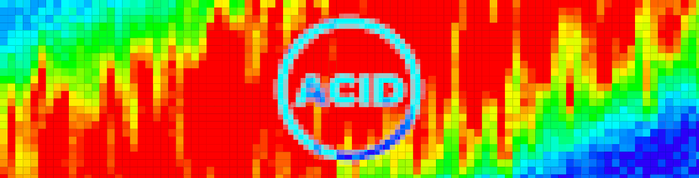
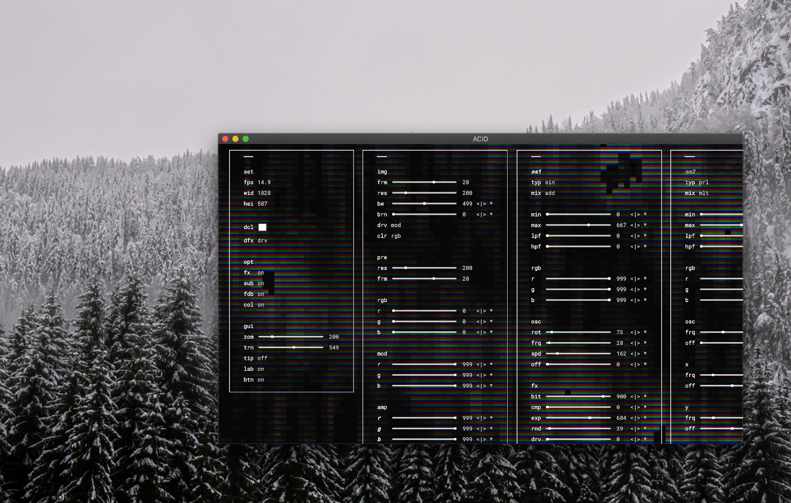
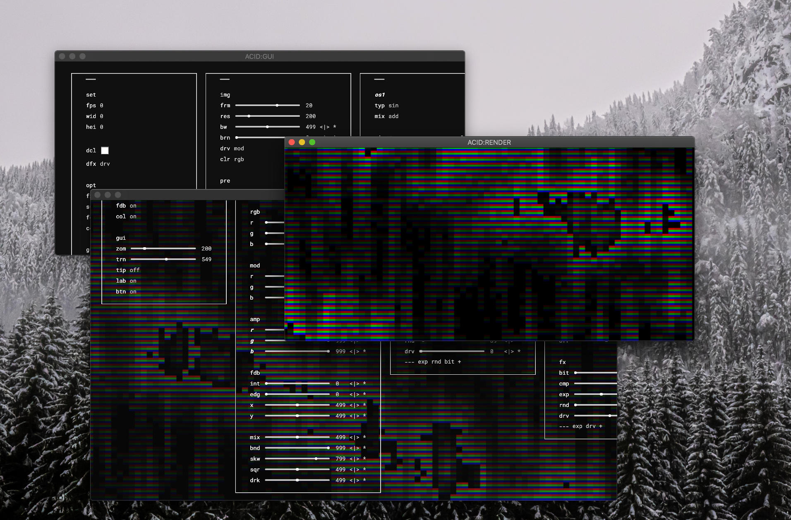

# ACID

ACID is short for **A**lgorithms **C**reate **I**mage **D**ata and is a simple, general purpose video synthesizer for creating live visuals and computer generated images and animations. It works somewhat similar to an analog synthesizer with a little bit of Photoshop thrown in.

ACID features a clean graphic user interface that can be detached. ACID has built in export to PNG and JPG and can record GIFs and WEBM videos of any length straight out of the program. The render window can be detached to use ACID for live visuals.

This is how the interface looks:



*GUI is opened in the main window*


*GUI is undocked*



*GUI and Render are both undocked*


This is how a patch could look. There are currently no available presets but you can use the "Random Patch" function in the menu to get started. You can see 100 random patches in this video: https://www.youtube.com/watch?v=u_rGDhfu_Qk

## Installation

You can either install a build for your platform or run ACID yourself with `npm`.

To download a build for your platform head over to [acidatm.itch.io/acid](https://acidatm.itch.io/acid) and download a build there. The download is free, there is only an optional donation.


Presets can be found in the `/presets` directory or can be downloaded on *itch.io* as well.


To run ACID withen *electron.js*, install `npm` and `git` (if you don't have them installed), then open your terminal and run:

```bash
git clone https://github.com/acidatm/acid
cd acid/app/
npm install
npm start
```

## Documentation

All values in the GUI range between 0 and 999, where 0 is the minimum value and 999 is the maximum. The GUI can be toggled either with the space bar or using the options in *Menubar > Window*. The GUI can also be opened in a second window.

The labels next to the sliders can be used to set a slider to specific value. The buttons next to the labels can be used to minimize, center, maximize or randomize the slider value. Both can be disabled from the *set* part of the GUI.

## Releases

Below you can find release notes on all major releases that had a dedicated build available. Look into the devlog over at [acidatm.itch.io/acid](https://acidatm.itch.io/acid) for more details.

- **0.2.0** React, MIDI and Modmatrix Update
  - Switched to React based UI
  - Completely redesigned UI
  - Switched to modular setup for channels, layers and windows, allowing for any amount of oscilators, which are now called layers
  - Added new render engines: Two textbased ones and one specialised for pixelart
  - Added new oscilators: generators, databased (bitmap, wavetable, granular), plasma and paths
  - Added full transport section
  - Added full export section
  - Added modmatrix
  - Added LFOs and Envelopes
  - Made parameters exposable on modmatrix
  - Added three new global effects: Feedback (Feedback is now called Timemachine), Error and Caleidoscope
  - Added standalone web renderer with definable inputs for scrolling, mouse, clicks and so on
  - Reworked generation algorithm
  - Refactored codebase to be more readable and maintainable
  
- **0.1.2** WebGL Update
  - ACID is now using WebGL instead of simple canvas which increases performance dramatically
  - A new subpixel option to get a more tv or analog look and feel
  - A new virtual feedback mode that simulates real camera to tv to camera feedback
  - A dedicated render only window can be undocked now, which makes use for VJing way better
  - Specific settings for framerate and resolution in main and undocked window
  - Additional settings for black and white fading and color burn out
  - Color modes are now based on 3 color channels instead of a singular value
  - Gradient color modes can now have any amount of steps
  - Many performance optimisations in the code
  - Additional optimization settings that can disable certain parts of the program for a better performance
  - Two new oscilators added: *pwm*, which is a pulse oscilator, and *org* which is a noise algorithm specialised for organic shape creation
  - A new random patch option in the menu
  - Keyboard shortcuts for various menu functions
  - Added analytics such as true framerate, width and height
  - Removed hsl color mode (but will be back soon, no worries)
  - Removed different render engines for now
  - Removed some unused parameters from the codebase
  - Removed some unnecessary settings in the GUI
  - Reverted to old window styles on Mac OS
  - Oscilator frequency as no longer linked to resolution
  - Renderloop is now called recursive at the start of the loop, making each frame roughly equal, no matter the calculation time
- **0.1.1** Release of the full alpha version
  - Reworked the *lpf* and *hpf* parameters to be relative to the *min* and *max* property
  - Removed the *amp* parameter on all oscilators, as it's behavior can be duplicated using the *max* parameter
  - Reworked the *amp* parameter on the bus to not be able to overdrive the sum (use a *drv* effect instead)
  - Reworked all algorithmic oscilators to use fewer parameters
  - Added *off* as an oscilator type. Works just like toggling the oscilator when clicking on *osx*
  - Added *hsl* as a color mode
  - Enabled full 360 degree turning of oscilators with the *mod* parameter and removed the *rmp* oscilator shape (as its just a rotated *saw* oscilator)
  - Added a new oscilator shape *osc*, that can be faded between pure triangle over pure sine to pure square and also has pulse width modulation capabilitys.
  - Added sliders to the GUI, made number input optional, added optional buttons
  - Made the GUI have linear values for zoom and transparency, instead of different, fixed settings
  - Removed global effects (*err*) and instead added two more oscilators
  - Reworked the complex 2D render engine (*c2d*) to have dedicated values for the radius of all corners and the padding on all sides as well as a simple 2d render engine running "below" it, to control the background color of each cell
  - Made the compressor (*cmp*) work in one direction only, added a new expander (*exp*) effect that now works in reverse to compression
  - Added optional tooltips to the GUI
  - Added automatic load of a default patch upon first (or resetted) start up
  - Added a patch reset option to clear out a faulty storage and to automatically load a default patch
  - Added a stop option, to completely disable the rerender of the scene until play is hit
  - Added a framejump option, to increment the t value, when the render is paused or stopped
  - Fixed a bug, where the GUI would jump when an input was changed
  - Removed deprecated electron.js functions
  - Added proper error handling in case of crashes
  - Did some visual changes on the GUI
  - Unused parameters are now hidden in the UI until they are needed
- **0.1.0** Release of the initial alpha version

## Future Plans

- Input from serialport to support sensory data from Arduino and so on
- Input from OSC to allow sequencing by software on the same device, ORCA or VCV for instance
- Maybe add actual audio and video input
- Output controlpoints to MIDI, OSC, DMX etc. -> basically return the RGB value of a selected pixel as a value to these protocols
- Expand LFOs
- More specialized Algorithms
- More bitmap specific functionality
- Global effect like the stuff that Gysin does
- Presets
- Global effect that allows combination of available presets
- Optimize for performance, maybe use Web Assembly
- Add networking capabilities, basically allowing to view serverhosted sessions and control sessions on other devices
- Adding layer groups
- Allow control over all default values

## Documentation

### Overview

ACID consists of different layers with insert effects which are combined with different layermodes. The resulting final image is then passed through multiple mastering stages before it is being interpreted by the renderer. Rendered images can then be output on multiple different screens.

#### Signalpath

The resolution of a render window determines the amount of pixels that will be requested from ACID. For every pixel in the frame a rgb value is being returned from ACID. ACID takes x and y position as well as a framenumber and returns n values. Different render engines do different things with these n values.

For every pixel all layers are combined at the specific pixel. Every layer contains exactly one generating function which is passed through insert effects and can be summed by different amounts into the 4 color channels using different combinitation modes.

After all layers have been combined the total sum is passed through master effects before being sent to the render engine.

The mainwindow contains different windows for different parts of the synthesizer

- Settings: Clocking, Transport, Recording, Defaults
- Outputs - contains list and settings for all output windows
- Inputs - contains list of all registered incoming midi messages, display midi log, allows midi learn and adding of inputs
- Channels - contains list and settings for all running channels
- Layers - contains list of all layers
- Master - contains settings for the master effects
- Render - contains settings for the render engine
- Matrix - contains the modmatrix
- Modulation - contains LFOs and Envelopes

### Settings

- **UIX** UI/UX
- **TRN** Transport
  - **PLAY/PAUSE** Play/Pause - stops and starts the render engine
  - **RESET** Reset - resets the renderengine to frame 0
  - **SND** Send Transport - Toggles transport send
  - **REC** Recieve Transport - Toggles transport recieve
  - **FWD** Forward - jumps one frame forward
  - **RWD** Rewind - jumps one frame back
  - **FFD** Fast Forward - jumps SPD frames forward
  - **FRW** Fast Rewind - jumps SPD frames backwards
  - **SPD** Fast Speed - sets number of frames to jump for the fast buttons
  - ***FRM** Frame - Sets the exact frame number*
  - ***LEN** Length - Sets the total render length, 0 means none, after which the clock will be reset*
- **DFL** Default
- **CLK** Clock
  - **REC** External Clock - Toggles external clock
  - **SND** Output Clock - Toggles the send of a midi clock
  - **BPM** Beats per minute - Sets the internal clock to a fixed amount of beats per minute
  - ***DIV** Beatdivision*
- **EXP** Export
  - **JPG** JPG - Exports a JPG of current frame
  - **PNG** PNG - Exports a PNG of current frame
  - **REC** Records - Starts/Stops the recording of a WEBM video
  - **GIF** GIF - Starts/Stops the recording of a GIF, stops the live generation, sets to STR frame renders each frame fully and pauses after reaching STP frame
  - **STR** Start - Startframe for GIF animation
  - **END** Stop - Stopframe for GIF animation

### Outputs

Currently ACID only outputs visual information and MIDI clock, but I plan to output MIDI, OSC, CV (or rather Serial Port Data) and DMX in the future. So for now the output tab only contains windows. It will at least contain the preview window for the GUI. New windows can be added from here.

- **WIN** Windows

  - ~~**IND** Index - Single character index~~
  - ~~**COL** Colorcode - HEX colorcode~~
  - **LBL** Label - Name of the window

  - **FRM** Framerate - sets the target framerate
  - **RES** Resolution - sets the render resolution
  - **REL** Relative - Toggles relative/fixed resolution

### Inputs

Currently ACID only accepts MIDI but I plan to add more inputs in the future. The MIDI window contains:

- **DEV** Devices - shows all connected midi devices
  - RFR Refresh - Refreshes Device List
  - RMV Remove - Removes a device and stops listening to its input
  - **TRN** Transport - Sets device as transport source
  - **CLK** Clock - Sets device as clock source
  - **OUT** Output - Sets device as clock target
- **LOG** Midilog - logs all incoming midi messages with the 3 databytes
  - Either select one databyte to learn the message, add it as an input to the modmatrix and patch the value of the selected databyte to the matric
  - Or select the whole message to use this exact message to trigger envelopes basically only recieving when the message is recieved but nothing else
- **MSG** Messages - list all messages we are currently listening to
  - **COL** Colorcode - HEX colorcode
  - **LBL** Label - Messagelabel

### Channels

You will need a minimum amout of 1 channel. Every channel contains a value between 0 and 1 for every pixel in the render window. Different engines will want different amount of channels but you can run all engines with just one channel. Every channel has these paramters:

- **TRS** Treshold - Treshold parameter for compression
- **HDR** Headroom - Headroom for analog emulations
- Channels
  - **LBL** Label - Channelname
  - **IND** Index - Single character channel index
  - **MIN** Minimum - Flooring value for the channel
  - **MAX** Maximum - Maximum value for the channel
  - **MOD** Modulate - Amount of allowed modulation from the MIN to the MAX
  - **CLP** Clipmode - Clipmode for this specific channel
    - **RST** Reset - Simply clips all values above 1 to 0
    - **DIG** Digital - clips all values above 1 to 1
    - ***ANL** Analog - uses the compress treshold and applys a nonlinear effect to the part above the treshold using the difference from the treshold as an intensity for the noise*
    - **MOD** Modify - used a mod operator and loops values back around until they are between 0 and 1
    - **DYN** Dynamic - scales all values between lowest and highest value in the channel measured in each frame
    - ***CMP** Compress - like dynamic but only rescales values above a certain treshold*

### Layers

All layers contain a generator, a filter, effects and a 4 channel mixer.

Layers can be hidden/disabled, labeled, colorcoded and rearranged.

Layers can be added into recursive groups which can be hidden/disabled, labeled, colorcoded and rearranged.
Every layergroup also has a shared filter, effects and mixer.

#### Layer

- **OFF** Disabled - toggles the layer
- **FAD** Opacity - sets the layers opacity
- **IND** Index - single character index
- **LBL** Label - naming label

#### Generators

Generators take 3 values, x,y and t/d and return a single value between 0 and 1. Every generator has a certain set of parameters, some of which are shared between multiple generators

1. Generators

   - **SLD** Solid - Returns a consistent value, you can also use a squarewave oscilator to generate consistent values
     - **CLR** Color -> FRQ
   - **STR** Stripes - Returns a stripe pattern, you can also use a squarewave oscilator to generate stripes
     - **FRQ** Frequency
     - **ROT** Rotation
   - **CHS** Chessboard - Returns a checker pattern which can be rotated and also be used as a grid by setting the spacing
     - **SIZ** Size -> FRQ
     - **SPC** Spacing -> OFF
     - **XSZ** X Size -> XFRQ
     - **YSZ** Y Size -> YFRQ
     - **ROT** Rotation
   - **GRD** Gradient - Returns a gradient from a floor to a ceiling value, you also can use a triangle oscilator to generate linear gradients
     - **STR** Start -> FRQ
     - **END** End -> XFRQ
     - **ROT** Rotation
   - **4GR** Cornergradient - Returns a gradient based on 4 different corner values
     - **UPL** Upper Left
     - **UPR** Upper Right
     - **BTL** Bottom Left
     - **BTR** Bottom Right
   - ***CGR** Circlegradient - Returns a circular gradient from an inner to an outer color*
   - **NSX** Noise - Returns full spectrum noise

2. Oscilators

   - **SQR** Square - square shaped oscilator
   - **SAW** Saw - saw wave oscilator
   - **TRI** Triangle - triangle shaped oscilator
   - **SIN** Sine - sinewave oscilator
     - **FRQ**
     - **SPD**
     - **ROT**
     - **OFF**
   - **OSC** Oscilator - multishape oscilator that can be turned from triangle over sine into square
     - **CEN**
     - **SHP**

3. Algorithms

   - **PRL** Perlin - perlin noise generator
   - **PLX** Simplex - simplex noise generator
     - **XFR** X Frequency -> XFRQ
     - **XPN** X Panning -> XOFF
     - **YFR** X Frequency -> YFRQ
     - **YPN** X Panning -> YOFF
     - **ZFR** X Frequency -> ZFRQ
     - **ZPN** X Panning -> ZOFF

4. 

   - **ORG** Organic - perlin based algorithm specialised in organic shape creation a bit like tree stumps
     - **???** -> FRQ
     - **???** -> OFF
   - ***PLS** Plasma - stacked noise algorithm specialised in plasma or cloud like shapes*
   - ***PTH** Paths - noise algorithm specialised in creating paths or cracks*
   - **LBY** Labyrinth - noise algorithm specialised in creating geometric labyrinths
   - **BBL** Bubbles - specialised in creating organic bubbles

5. Data

   - ***BIT** Bitmap - displays a 1-bit bitmap image, which can be scaled, animated, repeated, stretched and so on*
   - ***BIN** Binary - uses a binary sequence and breakpoints as a source for a bitmap*
   - ***WAV** Wavetable - uses 3 dimensional array of floating point values as wavetables*
   - ***GRN** Granular - uses a array of floating point values as the basis for a granular patch*

   #### Parameters

   Many generators share the same parameters or simply remap them so this is the full list of all parameters:

   - **FRQ** Frequency - changes cyclc repeat frequency of the oscilator on x axis.  Also used for stretching noise.

   - **SPD** Speed - changes shifting speed of the oscilator, biderectional

   - **ROT** Rotation - rotates the layer

   - **CEN** Center - Dynamic oscilator center

   - **SHP** Shape - Dynamic oscilator shape
   - **OFF** Offset - offset by wavelength on x axis, only really usefull when speed is 0. Also used for panning noise
   - **X FRQ** Frequency - changes cyclc repeat frequency of the oscilator on x axis.  Also used for stretching noise.

   - **X OFF** Offset - offset by wavelength on x axis, only really usefull when speed is 0. Also used for panning noise

   - **Y FRQ** Frequency - changes cyclc repeat frequency of the oscilator  on y axis. Also used for stretching noise.

   - **Y OFF** Offset - offset by wavelength on y axis, only really usefull when speed is 0. Also used for panning noise

   - **Z FRQ** Frequency - changes cyclc repeat frequency of the oscilator  on z axis. Also used for stretching noise.

   - **Z OFF** Offset - offset by wavelength  on z axis, only really usefull when speed is 0.  Also used for panning noise

   

   

   

#### Filter

The filter clamps the returned values within a certain range

- **MIN** Minimum - The minimum value that will be generated
- **MAX** Maximum - The maximum value that will be generated
- **LPF** Lowpassfilter - All values above will be cut away
- **HPF** Hipassfilter - All values below will be cut away
- ***DRV** Overdrive - Drive effect inserted before the filter*
- ***CNT** Contrast - Can be used to rescale values after the filter, at 0 no changes are made, at 1 the lowest value will be scaled to 0 and the highest to 1*

#### Mixer

The mixer has a channel for every channel defined in the channels sections. Each channel has the same parameters

- **BYP** Bypass - Toggles singular channels
- **SND** Send - shared send value used for all channels used when bypass is enabled
- **MIX** Mixmode - shared mixmode for all channels used when bypass is enabled
- **CHX** Channel X - Send amount into the channel
  - **MIX** Mixmode - Mixmode for this channel
    - **ADD** Additive - Adds value to the mix
    - **SUB** Substract - Substract value from the mix
    - **MLT** Multiply - Multiplys mix by value (inverted as we are using values between 0 and 1)
    - **DIV** Divide - Divides mix by value (inverted as we are using values between 0 and 1)

#### Effects

The effects chain contains patched insert effects with sends and a global wet/dry knob as well as a bypass button

- **BYP** Bypass - Toggles all effects
- **WET** Wet/Dry - Mixes between full and no effects
- Effects
  - **BIT** Bitcrush - reduces the full scale down to a certain amount of steps
  - **RND** Randomize - randomizes all values
  - **CMP** Compress - compresses the values effecting larger values stronger then smaller ones
  - **EXP** Expand - expands the values effecting smaller values stronger then bigger ones
  - **AMP** Amplify - amplify all values, mainly used for gainstaging with effects, also needed to clip a channel though
  - **ATT** Attenuate - attenuates all values, mainly used for gainstaging with effects

### Master

The master section contains multiple global effects which can only be used on the sum of all layers. Effects can be toggled and reordered

- **FDB** Feedback - Analog Feedback Emulation
- **TMX** Timemachine - Feedback but also into the future
- **CAL** Caleidoscop - Mirror, Flip and Symetry
- **ERR** Error - Simulates ripping the RAM out of a running computer while mutating unsafe raw pointers

### Render

Contains settings for the selected render engine (as well as an option to change the render engine)

- **DIG** Digital - Standard Digital Render engine which uses OpenGL Shading
  - **SKW** Skew - Skew in one or the other direction

- **PIX** Pixel - For pixel based rendering, including seperating lines, glow fx and hardware colormode emulation
  - **RST** Raster - adds raster spacing
  - **GLW** Glow - adds pixe glow
  - Additions to the colormodes
    - **GBA** original gameboy color
    - **CGA** CGA colormodes https://www.youtube.com/watch?v=niKblgZupOc

- **PAL** Phase Alternating Line - For that analogue feel, simulating subpixels, allowing you to set custom colors for rgb channels, offering an emulation of the color settings of all tvs. And optional scanline emulation
  - **SUB** Subpixelmode
    - Vertical
    - Horizontal

  - **RED** Red - Color that is used as red
  - **GRN** Green - Color that is used as green
  - **BLU** Blue - Color that is used as blue

- **ASC** ASCII - Glyphbased ASCII Rendering engine which uses skewablae cells and has extra channels for glyph, glypcolor and background
- **TXT** Text - Simple textbased rendering engine which has a PAL mode to simulate tv text

#### Shared Parameters

- **CLR** Colormode
  - **RGB** map channels to RGBA
  - **HSL** map channels to HSLA
  - **GRD** indexed color map with interpolated steps
  - **NDX** indexed color map with no interpolation

### Matrix

The Modmatrix contains columns for sources and rows for targets. Sources and targets are connected by pins. When both are linear the pin can attenuvert (attenuate and/or invert) the connection, when the source is linear (on a range) and the target is binary (on or off) the pin can set the treshold (after which value does the source count as high) and invert (switch between source low -> target high and source low -> target low). When both source and target are binary the pin can simply invert. Pins can be removed and disabled.

The modmatrix is also used to map channels to renderinputs.

The modmatrix contains these sources:

- Channels - source node for all channels. can only be connected to renderchannels
- LFOs - Outputs for the LFOs
- Envelopes - Outputs for the envelopes
- Clock - Divisions of the mainclock/framecounter, mainly used to trigger envelops
- MIDI - Output for all MIDI Inputs

The modmatric contains these targets:

- Renderchannels - targetnode for all renderchannels. can only be connected to channels
- Envelopetriggers - triggers for all envelopes in the modulation section
- Exposed Parameters - all parameters you have exposed

### Modulation

The Modulation section contains all modulation sources for the modmatrix. It currently only holds envelopes (which need to be triggered through the modmatrix as well) and LFOs

- **LFO** LFOs - Low frequency oscilators
  - **SHP** Shape - Shape of the LFO
    - **TRI** Triangle
    - **SIN** Sine
    - **SQR** Square
  - **FRQ** Frequency - Speed of the LFO
  - **SNC** Sync - Toggles sync to framerate/clock, makes FRQ a relative value


Confirm before deletion and clear!

Dropdown Selection

Settings in extra window with selection of defaults

Layergroups

Different modules for different generators

Sliders have wrong init values

#### Bitmaps, Multichannel Bitmaps, Animations, Waveshapes and Wavetables

While these are generally not the same, ACID handles them all in the same way. Each of this data forms is represented as a 2 dimensional Array, with the outer layer being the container and the inner layer being the data. The outer layer contains only 1 data element for bitmaps (the bitmap) and waveshapes (the waveshape) while containing any number of data for Animations (a collection of bitmaps) and Wavetables (a collection of waveshapes). So a Bitmaps is really a single frame Animation and a Waveshap is really a single waveform Wavetable.

A Multichannel Bitmaps is a special kind of bitmap and is really only important when importing. What this basically means that an imported image is split into rgb channels and each channel is added as an Animation frame. So we can either animate through the channels or send each frame to a different channel at the same time to see the image in color.

The inner data is handled as a stream of data for Waveshapes (like a sample buffer) and as a two dimensional matrix for Bitmaps (like a bitmap image). Two turn a stream into a two dimensional matrix a width is set. This is basically the number of datapoints after which the matrix breaks into the next row. This allows us to treat bitmap images as waveshapes and vice versa. Additionally there is a resolution value that decides how many steps between 0 and 1 are treated. This resolution defaults to 0, which means values are either 1 or 0 but can be set later.
